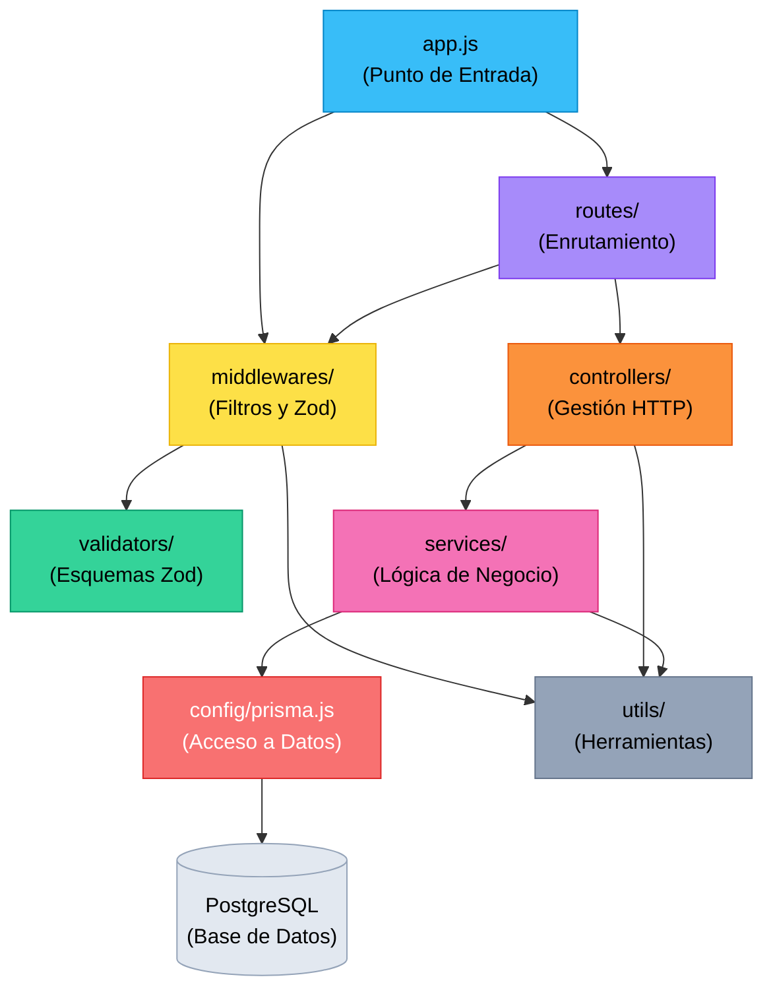

# Arquitectura por Capas — API Poncho Digital
### Fiesta Nacional e Internacional del Poncho (Catamarca)
**Cátedra:** Desarrollo Backend — **Carrera:** Tecnicatura Universitaria en Diseño de Software (UNCa)

Este documento explica la organización modular en capas del proyecto, qué responsabilidad asume cada una, qué reglas de negocio maneja y cómo interactúan los componentes para cumplir los estándares de la cátedra.

---

## Índice
1. [¿Qué es una Arquitectura por Capas?](#qué-es-una-arquitectura-por-capas)
2. [Estructura del Proyecto](#estructura-del-proyecto)
3. [Capa 1: Punto de Entrada (`app.js`)](#capa-1-punto-de-entrada-appjs)
4. [Capa 2: Rutas (`routes/`)](#capa-2-rutas-routes)
5. [Capa 3: Middlewares (`middlewares/`)](#capa-3-middlewares-middlewares)
6. [Capa 4: Validadores (`validators/`)](#capa-4-validadores-validators)
7. [Capa 5: Controladores (`controllers/`)](#capa-5-controladores-controllers)
8. [Capa 6: Servicios (`services/`)](#capa-6-servicios-services)
9. [Capa 7: Acceso a Datos — Prisma ORM (`config/`, `prisma/`)](#capa-7-acceso-a-datos--prisma-orm)
10. [Capa Transversal: Utilidades (`utils/`)](#capa-transversal-utilidades-utils)
11. [Flujo Completo de una Petición](#flujo-completo-de-una-petición)
12. [Reglas de Negocio por Entidad](#reglas-de-negocio-por-entidad)
13. [Tabla Resumen: Quién Hace Qué](#tabla-resumen-quién-hace-qué)
14. [Diagrama de Dependencias entre Capas](#diagrama-de-dependencias-entre-capas)

---

## ¿Qué es una Arquitectura por Capas?

Es un patrón de diseño que divide el software en niveles jerárquicos donde **cada capa tiene una responsabilidad única y bien delimitada**:

* La capa HTTP no conoce detalles de la base de datos.
* La capa de persistencia no depende de Express ni de `req`/`res`.
* La validación de entrada ocurre antes de que el controlador comience a procesar la solicitud.

---

## Estructura del Proyecto

```text
src/
├── app.js                          ← Punto de entrada (configura Express, middlewares y rutas)
│
├── routes/                         ← Capa de Enrutamiento (define endpoints y handlers)
│   ├── artesano.routes.js
│   └── producto.routes.js
│
├── middlewares/                     ← Capa de Middlewares (filtros intermedios)
│   ├── logger.js                   ← Monitoreo de tiempos y estado HTTP
│   ├── manejoErrores.js            ← Red de seguridad global para respuestas JSON
│   ├── rutaNoEncontrada.js         ← Captura de 404
│   └── validaciones/
│       ├── validarId.js            ← Validación de parámetros URL (:id)
│       ├── validarProducto.js      ← Validación de body con Zod (entrega DTO)
│       └── validarQuerys.js        ← Validación de query string con Zod (filtros y paginación)
│
├── validators/                     ← Capa de Esquemas de Validación (Zod)
│   └── producto.schemas.js         ← Contratos de entrada (body, params y querys)
│
├── controllers/                    ← Capa de Controladores (gestión HTTP y delegación DTO)
│   ├── artesano.controllers.js
│   └── producto.controllers.js
│
├── services/                       ← Capa de Servicios (lógica de negocio y persistencia con Prisma)
│   └── producto.services.js
│
├── config/                         ← Capa de Configuración
│   └── prisma.js                  ← Instancia compartida de Prisma Client con adapter-pg
│
├── utils/                          ← Utilidades transversales
│   ├── crearError.js              ← Fábrica de errores HTTP con status y details
│   └── ErroresZod.js              ← Formateador estructurado de errores Zod { path, message }
│
└── generated/prisma/               ← Cliente generado por Prisma ORM
```

---

## Capa 1: Punto de Entrada (`app.js`)

**Archivo:** `src/app.js`  
**Responsabilidad:** Configurar Express, registrar middlewares globales y montar los enrutadores principales.

```javascript
app.use('/artesanos', artesanosRoutes);
app.use('/productos', productosRoutes);
app.use(rutaNoEncontrada);
app.use(manejoErrores);
```

---

## Capa 2: Rutas (`routes/`)

**Archivos:** `src/routes/artesano.routes.js`, `src/routes/producto.routes.js`  
**Responsabilidad:** Declarar los endpoints y establecer el orden de ejecución:
1. Validaciones previas (`validarId`, `validarProducto`, `validarConsultaProductos`).
2. Controlador final.

```javascript
router.get('/', validarConsultaProductos, getProductos);
router.get('/:id', validarId, getProductoPorId);
router.post('/', validarProducto, createProducto);
router.put('/:id', validarId, validarProducto, updateProducto);
router.delete('/:id', validarId, deleteProducto);
router.patch('/:id', validarId, deleteProductoLogico);
```

---

## Capa 3: Middlewares (`middlewares/`)

**Responsabilidad:** Interceptar y procesar la petición antes o después de los controladores.

* **`logger.js`**: Mide con precisión milisegundos y status HTTP al completarse la respuesta (`res.on('finish')`).
* **`validarId.js`**: Comprueba y sanitiza el parámetro `:id` en la URL utilizando Zod (`FiltrarProductoPorIDSchema`) y lo castea a tipo `Number`.
* **`validarQuerys.js`**: Evalúa parámetros de consulta (`req.query`) con `obtenerProductosSchema` para filtros, ordenamiento y paginación, inyectando `req.consultaProductos`.
* **`validarProducto.js`**: Evalúa el método mediante un `switch` (`POST` y `PUT`) y ejecuta `safeParse(...)` con Zod sobre `req.body ?? {}`. Si es válido, reemplaza los datos con `resultado.data` (DTO limpio). Si falla, delega a `detallarErroresZod` y `crearError`.
* **`rutaNoEncontrada.js`**: Captura URLs que no coincidan con ninguna ruta registrada y arroja 404.
* **`manejoErrores.js`**: Middleware final de 4 parámetros `(err, req, res, next)` que estandariza las respuestas de error en formato JSON homogéneo `{ error, details? }`.

---

## Capa 4: Validadores (`validators/`)

**Archivo:** `src/validators/producto.schemas.js`  
**Responsabilidad:** Declarar los contratos formales que debe cumplir el cuerpo de la petición, los parámetros de ruta y los query strings usando **Zod 4**.

```javascript
export const crearProductoSchema = z.object({ ... });
export const actualizarProductoSchema = z.object({ ... });
export const FiltrarProductoPorIDSchema = z.object({ ... });
export const obtenerProductosSchema = z.object({ ... });
```

---

## Capa 5: Controladores (`controllers/`)

**Archivos:** `src/controllers/artesano.controllers.js`, `src/controllers/producto.controllers.js`  
**Responsabilidad:** Coordinar el flujo HTTP.
* Recibe los datos validados desde `req.body` como un **DTO** o el `id` desde `req.params`.
* Invoca a la capa de servicios:
  ```javascript
  const crearProductoDto = req.body;
  const nuevoProducto = await crearProducto(crearProductoDto);
  return res.status(201).json(nuevoProducto);
  ```
* Para borrado físico y lógico:
  ```javascript
  // Borrado físico:
  await eliminarProducto(id);
  res.status(200).send("Producto eliminado exitosamente");

  // Borrado lógico:
  await deleteLogico(id);
  res.status(200).json({ message: "Producto eliminado logicamente" });
  ```
* En caso de error, el bloque `try/catch` lo remite a `next(error)`.

---

## Capa 6: Servicios (`services/`)

**Archivo:** `src/services/producto.services.js`  
**Responsabilidad:** Contener la lógica de negocio y comunicarse directamente con Prisma Client.

* **Desacoplado de Express:** No recibe `req`, `res` ni `next`. Trabaja únicamente con tipos primitivos y DTOs planos. Si ocurre un fallo de negocio, lanza excepciones mediante `throw crearError(...)` que el controlador captura en su bloque `catch`.
* **Reglas de negocio y persistencia limpia:**
  - `crearProducto`: comprueba la existencia previa del artesano.
  - `actualizarProducto`: valida existencia del producto y del artesano si se envía.
  - `obtenerProductoPorId`: busca el producto y lanza 404 si no existe.
  - `eliminarProducto`: verifica existencia previa y elimina definitivamente el registro con `prisma.producto.delete`.
  - `deleteLogico`: verifica existencia y actualiza el flag `eliminado: true` con `prisma.producto.update`.

---

## Capa 7: Acceso a Datos — Prisma ORM (`config/`, `prisma/`)

**Archivos:** `src/config/prisma.js`, `prisma/schema.prisma`  
**Responsabilidad:** Definir las tablas relacionales en PostgreSQL y proveer el cliente de consultas.

```prisma
model Artesano {
  id                     Int        @id @default(autoincrement())
  nombre                 String
  apellido               String
  dni                    String     @unique
  email                  String     @unique
  telefono               String?
  localidad              String
  rubro                  String
  nombreEmprendimiento   String
  descripcionTrayectoria String?
  productos              Producto[]
  createdAt              DateTime   @default(now())
  updatedAt              DateTime   @default(now()) @updatedAt
}

model Producto {
  id          Int      @id @default(autoincrement())
  nombre      String
  descripcion String?
  precio      Float
  stock       Int      @default(0)
  artesanoId  Int
  artesano    Artesano @relation(fields: [artesanoId], references: [id], onDelete: Cascade)
  createdAt   DateTime @default(now())
  updatedAt   DateTime @default(now()) @updatedAt
}
```

---

## Flujo Completo de una Petición

### Caso Exitoso: `POST /productos`

```text
Cliente envía POST /productos
{ "nombre": "Poncho de Vicuña", "precio": 180000, "artesanoId": 1 }
   │
   ▼
app.js (express.json() parsea body, logger inicia cronómetro)
   │
   ▼
producto.routes.js (router.post('/', validarProducto, createProducto))
   │
   ▼
validarProducto.js (Zod ejecuta safeParse: datos válidos)
   │  → Asigna req.body = resultado.data (DTO)
   ▼
producto.controllers.js (createProducto)
   │  → const crearProductoDto = req.body
   │  → Invoca: await crearProductoService(crearProductoDto)
   ▼
producto.services.js (crearProducto)
   │  → 1. ¿Existe artesanoId 1? Sí
   │  → 2. prisma.producto.create(...)
   ▼
Prisma ORM → PostgreSQL (Persiste en tabla "Producto")
   │
   ▼
Vuelta: BD → Prisma → Service → Controller
   │
   ▼
Controller responde: 201 Created con el objeto JSON creado
```

### Caso Error 1: Formato inválido (Rechazado en Middleware Zod)
```text
Body: { "nombre": "  ", "precio": -50 }
   │
   ▼
validarProducto.js (safeParse detecta fallos)
   │
   ▼
next(crearError("Error en el campo 'nombre'...", 400))
   │  (El controlador y el servicio NUNCA se ejecutan)
   ▼
manejoErrores.js responde: 400 Bad Request
```

### Caso Error 2: Regla de negocio rota (Rechazado en Servicio)
```text
Body: { "nombre": "Poncho", "precio": 1000, "artesanoId": 9999 }
   │
   ▼
validarProducto.js (Formato válido)
   │
   ▼
producto.controllers.js delega a producto.services.js
   │
   ▼
producto.services.js comprueba en BD: artesano 9999 NO existe
   │
   ▼
throw crearError("Artesano inexistente.", 400)
   │
   ▼
Controller captura en catch(error) y envía a next(error)
   │
   ▼
manejoErrores.js responde: 400 Bad Request ("Artesano inexistente.")
```

---

## Reglas de Negocio por Entidad

### Artesano
| Regla | Capa | Detalle |
|---|---|---|
| DNI único | Prisma / Controller | No puede haber dos artesanos con el mismo documento |
| Email único | Prisma / Controller | No puede haber dos artesanos con el mismo correo |
| Datos obligatorios | Controller | Nombre, apellido, dni, email, localidad, rubro y emprendimiento |

### Producto
| Regla | Capa | Detalle |
|---|---|---|
| Nombre obligatorio | `validators/producto.schemas.js` | Mínimo 1 carácter sin espacios en blanco |
| Precio positivo | `validators/producto.schemas.js` | Mayor a 0 |
| Stock no negativo | `validators/producto.schemas.js` | Mayor o igual a 0 |
| Artesano existente | `services/producto.services.js` | El producto debe vincularse a un artesano registrado en la BD |
| Eliminación en cascada | `prisma/schema.prisma` | Si se elimina un artesano, se eliminan sus productos |

---

## Tabla Resumen: Quién Hace Qué

| Capa | Carpeta | Responsabilidad | Importa | NO importa |
|---|---|---|---|---|
| **Punto de Entrada** | `app.js` | Configura Express y monta rutas | `express`, `routes`, `middlewares` | `prisma`, `validators` |
| **Rutas** | `routes/` | Declara endpoints y orden de handlers | `controllers`, `middlewares` | `prisma`, `validators` |
| **Middlewares** | `middlewares/` | Valida con Zod, monitorea y captura errores | `utils`, `validators` | `prisma`, `controllers` |
| **Validadores** | `validators/` | Define contratos Zod | `zod` | Todo lo demás |
| **Controladores** | `controllers/` | Recibe HTTP, transfiere DTO, responde | `services`, `utils`, `prisma` (GETs) | `express.Router`, `validators` |
| **Servicios** | `services/` | Lógica de negocio y persistencia | `prisma`, `utils` | `express` (`req`/`res`), `validators` |
| **Acceso a Datos** | `config/`, `prisma/` | Conexión y modelos de base de datos | `@prisma`, `dotenv` | Todo lo demás |
| **Utilidades** | `utils/` | Estandarización de errores | Independiente | Todo lo demás |

---

## Diagrama de Dependencias entre Capas


