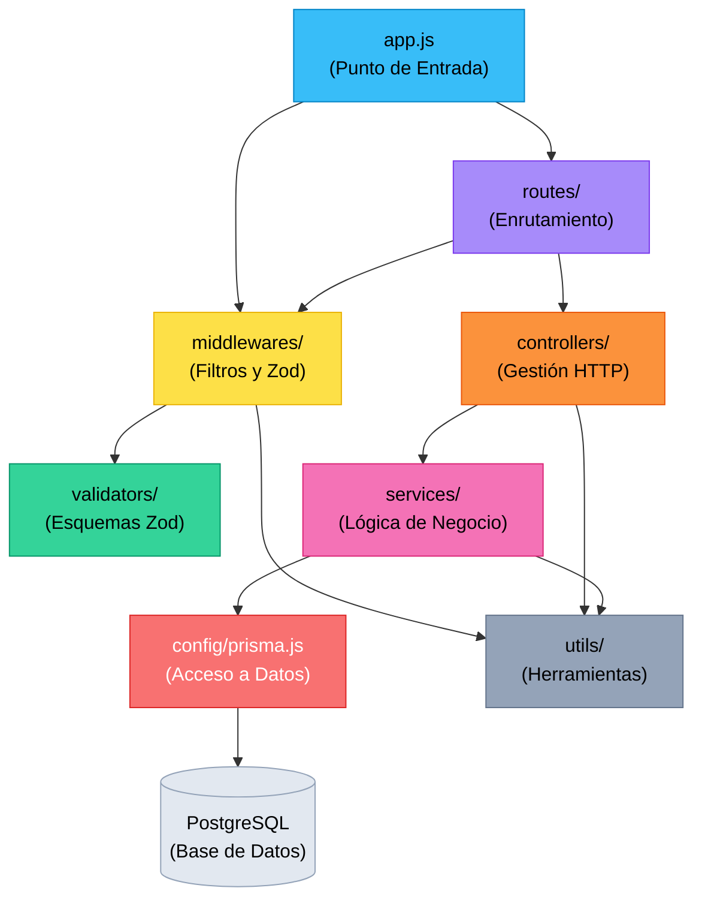

# Arquitectura por Capas — API Poncho Digital
### Fiesta Nacional e Internacional del Poncho (Catamarca)
**Cátedra:** Desarrollo Backend — **Carrera:** Tecnicatura Universitaria en Diseño de Software (UNCa)

Este documento explica la organización modular en capas del proyecto, qué responsabilidad asume cada una, qué reglas de negocio maneja y cómo interactúan los componentes para cumplir los estándares de la cátedra.

---

## Índice
1. [¿Qué es una Arquitectura por Capas?](#qué-es-una-arquitectura-por-capas)
2. [Estructura del Proyecto](#estructura-del-proyecto)
3. [Capa 1: Punto de Entrada (`app.js`)](#capa-1-punto-de-entrada-appjs)
4. [Capa 2: Rutas (`routes/`)](#capa-2-rutas-routes)
5. [Capa 3: Middlewares (`middlewares/`)](#capa-3-middlewares-middlewares)
6. [Capa 4: Validadores (`validators/`)](#capa-4-validadores-validators)
7. [Capa 5: Controladores (`controllers/`)](#capa-5-controladores-controllers)
8. [Capa 6: Servicios (`services/`)](#capa-6-servicios-services)
9. [Capa 7: Acceso a Datos — Prisma ORM (`config/`, `prisma/`)](#capa-7-acceso-a-datos--prisma-orm)
10. [Capa Transversal: Utilidades (`utils/`)](#capa-transversal-utilidades-utils)
11. [Flujo Completo de una Petición](#flujo-completo-de-una-petición)
12. [Reglas de Negocio por Entidad](#reglas-de-negocio-por-entidad)
13. [Tabla Resumen: Quién Hace Qué](#tabla-resumen-quién-hace-qué)
14. [Diagrama de Dependencias entre Capas](#diagrama-de-dependencias-entre-capas)

---

## ¿Qué es una Arquitectura por Capas?

Es un patrón de diseño que divide el software en niveles jerárquicos donde **cada capa tiene una responsabilidad única y bien delimitada**:

* La capa HTTP no conoce detalles de la base de datos.
* La capa de persistencia no depende de Express ni de `req`/`res`.
* La validación de entrada ocurre antes de que el controlador comience a procesar la solicitud.

---

## Estructura del Proyecto

```text
src/
├── app.js                              ← Punto de entrada (configura Express, middlewares, rutas e inicia tareas)
│
├── routes/                             ← Capa de Enrutamiento (define endpoints y handlers)
│   ├── artesano.routes.js
│   ├── producto.routes.js
│   └── usuario.routes.js              ← Endpoints de registro, login, /me y /logout
│
├── middlewares/                         ← Capa de Middlewares (filtros intermedios)
│   ├── logger.js                       ← Monitoreo de tiempos y estado HTTP
│   ├── autenticarUsuario.js            ← Verificación de Bearer JWT y consulta de lista negra (revocaciones)
│   ├── manejoErrores.js                ← Red de seguridad global para respuestas JSON
│   ├── rutaNoEncontrada.js             ← Captura de 404
│   └── validarSchema.js                ← Fábrica universal de validación Zod (body, params, query)
│
├── validators/                         ← Capa de Esquemas de Validación (Zod 4)
│   ├── comun.schemas.js                ← Esquemas compartidos (validación de :id y enums)
│   ├── artesano.schemas.js
│   ├── producto.schemas.js
│   ├── stand.schemas.js
│   └── usuario.schemas.js
│
├── controllers/                        ← Capa de Controladores (gestión HTTP y delegación DTO)
│   ├── artesano.controllers.js
│   ├── producto.controllers.js
│   ├── sesiones.controllers.js        ← Controlador de cierre de sesión (revocación de token)
│   └── usuario.controllers.js         ← Registro, login con emisión de JWT y perfil (/me)
│
├── services/                           ← Capa de Servicios (lógica de negocio y persistencia con Prisma)
│   ├── artesano.services.js
│   ├── producto.services.js
│   ├── usuario.services.js            ← Registro, verificación bcrypt y búsqueda por ID
│   ├── token.services.js              ← Emisión HS256 (15m, JTI) y validación de claims con Zod
│   └── revocaciones.services.js       ← Comprobación, inserción y purga de tokens revocados
│
├── tareas/                             ← Tareas Programadas y Asíncronas en Segundo Plano
│   └── limpiezaRevocaciones.js        ← Purga periódica por hora de tokens expirados en la BD
│
├── config/                             ← Capa de Configuración
│   ├── prisma.js                      ← Instancia singleton de Prisma Client con adapter-pg
│   └── jwt.js                         ← Carga y validación estricta de variable JWT_SECRET
│
├── utils/                              ← Utilidades transversales
│   ├── crearError.js                  ← Fábrica de errores HTTP con status y details
│   └── ErroresZod.js                  ← Formateador estructurado de errores Zod { path, message }
│
└── generated/prisma/                   ← Cliente generado por Prisma ORM
```

---

## Capa 1: Punto de Entrada (`app.js`)

**Archivo:** `src/app.js`  
**Responsabilidad:** Configurar Express, registrar middlewares globales, montar los enrutadores principales e inicializar servicios en segundo plano y configuraciones críticas:

```javascript
import "./config/jwt.js"; // Valida presencia de JWT_SECRET en el entorno
import { iniciarLimpiezaRevocaciones } from "./tareas/limpiezaRevocaciones.js";

// Montaje de rutas
app.use('/artesanos',  artesanosRoutes);
app.use('/productos',  productosRoutes);
app.use('/usuarios',   usuariosRoutes);
app.use(rutaNoEncontrada);
app.use(manejoErrores);

app.listen(PORT, () => {
    console.log(`Servidor iniciado en puerto ${PORT}`);
    iniciarLimpiezaRevocaciones(); // Inicia daemon de purga periódica de tokens
});
```

---

## Capa 2: Rutas (`routes/`)

**Archivos:** `src/routes/artesano.routes.js`, `src/routes/producto.routes.js`, `src/routes/usuario.routes.js`  
**Responsabilidad:** Declarar los endpoints y establecer el orden de ejecución:
1. Validaciones previas con `validarSchema` (`query`, `params`, `body`).
2. Middlewares de seguridad y sesión (`autenticarUsuario`).
3. Controlador final.

```javascript
// Rutas de productos:
router.get('/', validarSchema(obtenerProductosSchema, 'query'), getProductos);
router.get('/:id', validarSchema(idParamSchema, 'params'), getProductoPorId);
router.post('/', validarSchema(crearProductoSchema, 'body'), createProducto);
router.put('/:id', validarSchema(idParamSchema, 'params'), validarSchema(actualizarProductoSchema, 'body'), updateProducto);
router.delete('/:id', validarSchema(idParamSchema, 'params'), deleteProducto);
router.patch('/:id', validarSchema(idParamSchema, 'params'), deleteProductoLogico);

// Rutas de autenticación y usuarios:
router.post("/registro", validarSchema(registrarUsuarioSchema, 'body'), postUsuario);
router.post("/login", validarSchema(iniciarSesionSchema, 'body'), iniciarSesion);
router.get("/me", autenticarUsuario, obtenerMiPerfil);
router.post("/logout", autenticarUsuario, cerrarSesion);
```

---

## Capa 3: Middlewares (`middlewares/`)

**Responsabilidad:** Interceptar y procesar la petición antes o después de los controladores.

* **`logger.js`**: Mide con precisión milisegundos y status HTTP al completarse la respuesta (`res.on('finish')`).
* **`validarSchema.js`**: Middleware fábrica universal de validación. Recibe el esquema Zod y el origen (`body`, `params`, `query`), aplica `safeParse()`, sanitiza y limpia los datos en `req[origen]`. Si hay fallos, delega a `detallarErroresZod` y `crearError(400)`.
* **`autenticarUsuario.js`**: Middleware de autenticación y seguridad mediante tokens JWT según estándar **RFC 6750**:
  - Extrae y valida el encabezado `Authorization: Bearer <token>`.
  - Verifica la firma criptográfica y expiración usando `verificarToken()`.
  - Consulta en base de datos si el identificador único `jti` está en la lista negra (`tokenEstaRevocado()`).
  - Emite cabeceras de respuesta `WWW-Authenticate` con diagnósticos ante fallos (`Bearer`, `error="invalid_request"`, `error="invalid_token"`).
  - Inyecta la identidad decodificada en `req.usuario = { id, jti, exp }` para los siguientes controladores.
* **`rutaNoEncontrada.js`**: Captura URLs que no coincidan con ninguna ruta registrada y arroja 404.
* **`manejoErrores.js`**: Middleware final de 4 parámetros `(err, req, res, next)` que estandariza las respuestas de error en formato JSON homogéneo `{ error, details? }`.

---

## Capa 4: Validadores (`validators/`)

**Archivos:** `src/validators/comun.schemas.js`, `src/validators/producto.schemas.js`  
**Responsabilidad:** Declarar los contratos formales que debe cumplir el cuerpo de la petición, los parámetros de ruta y los query strings usando **Zod 4**.

```javascript
// comun.schemas.js
export const idParamSchema = z.object({ ... });

// producto.schemas.js
export const crearProductoSchema = z.object({ ... });
export const actualizarProductoSchema = z.object({ ... });
export const obtenerProductosSchema = z.object({ ... });
```

---

## Capa 5: Controladores (`controllers/`)

**Archivos:** `src/controllers/artesano.controllers.js`, `src/controllers/producto.controllers.js`, `src/controllers/usuario.controllers.js`, `src/controllers/sesiones.controllers.js`  
**Responsabilidad:** Coordinar el flujo HTTP.
* Recibe los datos validados desde `req.body` como un **DTO** o el `id` desde `req.params`.
* Invoca a la capa de servicios:
  ```javascript
  // Creación de producto
  const crearProductoDto = req.body;
  const nuevoProducto = await crearProducto(crearProductoDto);
  return res.status(201).json(nuevoProducto);

  // Inicio de sesión y emisión de JWT:
  const usuario = await loginService(req.body);
  const token = generarToken(usuario);
  return res.status(200).json({ mensaje: "Inicio de sesión exitoso.", token, usuario });

  // Perfil autenticado (/me):
  const usuario = await obtenerUsuarioPorId(req.usuario.id);
  return res.status(200).json({ usuario });

  // Cierre de sesión (/logout):
  await revocarToken(req.usuario);
  return res.status(204).end();
  ```
* En caso de error, el bloque `try/catch` lo remite a `next(error)`.

---

## Capa 6: Servicios (`services/`)

**Archivos:** `src/services/producto.services.js`, `src/services/usuario.services.js`, `src/services/token.services.js`, `src/services/revocaciones.services.js`  
**Responsabilidad:** Contener la lógica de negocio, seguridad criptográfica y comunicarse directamente con Prisma Client.

* **Desacoplado de Express:** No recibe `req`, `res` ni `next`. Trabaja únicamente con tipos primitivos y DTOs planos. Si ocurre un fallo de negocio, lanza excepciones mediante `throw crearError(...)` que el controlador captura en su bloque `catch`.
* **Reglas de negocio y persistencia limpia:**
  - `producto.services.js`: comprueba existencia de artesanos, alta, modificación, bajas físicas (`delete`) y lógicas (`update activo: false`).
  - `usuario.services.js`: registra cuentas con hash Bcrypt (cost 10), valida login y provee `obtenerUsuarioPorId` con proyección segura (`select: { id, nombre, email }`).
  - `token.services.js`:
    - `generarToken`: emite un JWT firmado con HS256, expiración a 15 minutos (`expiresIn: "15m"`), subject `sub: usuario.id` y `jti: randomUUID()`.
    - `verificarToken`: verifica firma contra `secretoJWT`, algoritmos permitidos, y valida defensivamente los claims con **Zod** (`z.uuid().safeParse(payload.sub)` y `payload.jti`).
  - `revocaciones.services.js`:
    - `tokenEstaRevocado(jti)`: comprueba existencia del token en la tabla `TokenRevocado`.
    - `revocarToken({ jti, exp })`: almacena el `jti` y su fecha de expiración usando `prisma.tokenRevocado.upsert`.
    - `eliminarRevocacionesVencidas()`: elimina masivamente registros cuyo `venceEn` sea menor o igual a la fecha actual (`deleteMany`).

---

## Capa 7: Acceso a Datos y Configuración (`config/`, `prisma/`)

**Archivos:** `src/config/prisma.js`, `src/config/jwt.js`, `prisma/schema.prisma`  
**Responsabilidad:** Definir las tablas relacionales en PostgreSQL, validar secretos del entorno y proveer el cliente singleton de consultas.

```prisma
model Usuario {
  id           String     @id @default(uuid()) @db.Uuid
  rol          RolUsuario @default(VISITANTE)
  nombre       String
  email        String     @unique
  passwordHash String
  artesano     Artesano?
  createdAt    DateTime   @default(now())
  updatedAt    DateTime   @updatedAt
}

model Artesano {
  id                     Int        @id @default(autoincrement())
  usuarioId              String     @unique @db.Uuid
  usuario                Usuario    @relation(fields: [usuarioId], references: [id], onDelete: Cascade)
  localidadId            Int
  localidad              Localidad  @relation(fields: [localidadId], references: [id])
  nombre                 String
  apellido               String
  dni                    String     @unique
  email                  String     @unique
  telefono               String?
  nombreEmprendimiento   String
  rubro                  String
  descripcionTrayectoria String?    @db.Text
  activo                 Boolean    @default(true)
  productos              Producto[]
  stand                  Stand?
  createdAt              DateTime   @default(now())
  updatedAt              DateTime   @updatedAt
}

model Producto {
  id          Int      @id @default(autoincrement())
  artesanoId  Int
  artesano    Artesano @relation(fields: [artesanoId], references: [id], onDelete: Cascade)
  nombre      String
  descripcion String?  @db.Text
  precio      Decimal  @db.Decimal(10, 2)
  stock       Int      @default(0)
  activo      Boolean  @default(true)
  createdAt   DateTime @default(now())
  updatedAt   DateTime @updatedAt

  @@index([artesanoId])
}

model TokenRevocado {
  jti     String   @id
  venceEn DateTime

  @@index([venceEn])
}
```

---

## Capa 8: Tareas Programadas en Segundo Plano (`tareas/`)

**Archivo:** `src/tareas/limpiezaRevocaciones.js`  
**Responsabilidad:** Ejecutar procesos de mantenimiento en segundo plano sin bloquear el bucle de eventos de Node.js.
* **`iniciarLimpiezaRevocaciones()`**: Configura un bucle recurrente cada 1 hora (`60 * 60 * 1000` ms) utilizando `setTimeout(ejecutar, INTERVALO_MS).unref()`.
* Invoca `eliminarRevocacionesVencidas()` para purgar registros de la lista negra cuyos tokens ya hayan expirado naturalmente, evitando el crecimiento desmedido de la tabla `TokenRevocado`.

---

## Flujo Completo de una Petición

### Caso Exitoso: `POST /productos`

```text
Cliente envía POST /productos
{ "nombre": "Poncho de Vicuña", "precio": 180000, "artesanoId": 1 }
   │
   ▼
app.js (express.json() parsea body, logger inicia cronómetro)
   │
   ▼
producto.routes.js (router.post('/', validarProducto, createProducto))
   │
   ▼
validarProducto.js (Zod ejecuta safeParse: datos válidos)
   │  → Asigna req.body = resultado.data (DTO)
   ▼
producto.controllers.js (createProducto)
   │  → const crearProductoDto = req.body
   │  → Invoca: await crearProductoService(crearProductoDto)
   ▼
producto.services.js (crearProducto)
   │  → 1. ¿Existe artesanoId 1? Sí
   │  → 2. prisma.producto.create(...)
   ▼
Prisma ORM → PostgreSQL (Persiste en tabla "Producto")
   │
   ▼
Vuelta: BD → Prisma → Service → Controller
   │
   ▼
Controller responde: 201 Created con el objeto JSON creado
```

### Caso Error 1: Formato inválido (Rechazado en Middleware Zod)
```text
Body: { "nombre": "  ", "precio": -50 }
   │
   ▼
validarProducto.js (safeParse detecta fallos)
   │
   ▼
next(crearError("Error en el campo 'nombre'...", 400))
   │  (El controlador y el servicio NUNCA se ejecutan)
   ▼
manejoErrores.js responde: 400 Bad Request
```

### Caso Error 2: Regla de negocio rota (Rechazado en Servicio)
```text
Body: { "nombre": "Poncho", "precio": 1000, "artesanoId": 9999 }
   │
   ▼
validarProducto.js (Formato válido)
   │
   ▼
producto.controllers.js delega a producto.services.js
   │
   ▼
producto.services.js comprueba en BD: artesano 9999 NO existe
   │
   ▼
throw crearError("Artesano inexistente.", 400)
   │
   ▼
Controller captura en catch(error) y envía a next(error)
   │
   ▼
manejoErrores.js responde: 400 Bad Request ("Artesano inexistente.")
```

---

## Reglas de Negocio por Entidad

### Artesano
| Regla | Capa | Detalle |
|---|---|---|
| DNI único | `@unique` en Prisma | No puede haber dos artesanos con el mismo documento |
| Email único | `@unique` en Prisma | No puede haber dos artesanos con el mismo correo |
| Localidad existente | `services/artesano.services.js` | `localidadId` debe referenciar una `Localidad` registrada |
| Datos obligatorios | `validators/artesano.schemas.js` | nombre, apellido, dni, email, localidadId, rubro, nombreEmprendimiento |
| Soft delete | `services/artesano.services.js` | `DELETE /artesanos/:id` → `activo: false` (no se borra físicamente) |
| Filtro por activo | `services/artesano.services.js` | `GET /artesanos` filtra `activo: true` por defecto |

### Producto
| Regla | Capa | Detalle |
|---|---|---|
| Nombre obligatorio | `validators/producto.schemas.js` | Mínimo 1 carácter sin espacios en blanco |
| Precio positivo | `validators/producto.schemas.js` | Mayor a 0 |
| Stock no negativo | `validators/producto.schemas.js` | Mayor o igual a 0 |
| Artesano existente | `services/producto.services.js` | El producto debe vincularse a un artesano registrado |
| Eliminación en cascada | `prisma/schema.prisma` | `onDelete: Cascade` — si se elimina un artesano, sus productos se eliminan |
| Soft delete | `services/producto.services.js` | `PATCH /productos/:id` → `eliminado: true` |

### Localidad
| Regla | Capa | Detalle |
|---|---|---|
| Nombre único | `@unique` en Prisma | No puede haber dos localidades con el mismo nombre |
| Provincia con default | `prisma/schema.prisma` | Por defecto `"Catamarca"` |

### Stand
| Regla | Capa | Detalle |
|---|---|---|
| Código único | `@unique` en Prisma | Identificador único del stand (ej. `STD-101`) |
| Asignación 1:1 | `artesanoId @unique` | Un artesano tiene como máximo un stand |
| Asignación atómica | `services/stand.services.js` | Usa `prisma.$transaction` para evitar race conditions |
| Stand disponible | `services/stand.services.js` | Solo se puede asignar un stand con `estado: DISPONIBLE` |
| Artesano sin stand | `services/stand.services.js` | El artesano no puede tener otro stand ya asignado |

### SolicitudPostulacion
| Regla | Capa | Detalle |
|---|---|---|
| Estado controlado | `EstadoSolicitud` enum | `PENDIENTE`, `EN_REVISION`, `APROBADA`, `RECHAZADA` |
| Evaluación por evaluador | `evaluadorId UUID?` | Asignado a un usuario evaluador (`@relation("EvaluadorSolicitud")`) |
| Postulante obligatorio | `artesanoId Int` | Vínculo requerido con el artesano solicitante |

### Usuario
| Regla | Capa | Detalle |
|---|---|---|
| ID seguro | `id UUID` | Generado con `default(uuid())` a nivel base de datos |
| Email único | `@unique` en Prisma | Un solo usuario por dirección de email |
| Password hasheada | `services/usuario.services.js` | Encriptada de forma unidireccional con Bcrypt (cost 10) |
| Rol controlado | `RolUsuario` enum | `ADMINISTRADOR`, `EVALUADOR`, `ARTESANO`, `VISITANTE` (por defecto) |
| Rol por defecto | `@default(VISITANTE)` | Todo nuevo registro adquiere rol visitante automáticamente |

### Sesiones y Autenticación JWT (`TokenRevocado`)
| Regla | Capa | Detalle |
|---|---|---|
| Firma y expiración | `services/token.services.js` | Algoritmo HS256, vigencia de 15 minutos (`expiresIn: "15m"`) y secreto en `JWT_SECRET` |
| Identificador de token (JTI) | `services/token.services.js` | Cada token emitido genera un `jti` criptográfico con `crypto.randomUUID()` |
| Verificación defensiva Zod | `services/token.services.js` | Valida que `sub` sea UUID válido (`z.uuid()`), `exp` sea número y `jti` no esté vacío |
| Autenticación Bearer | `middlewares/autenticarUsuario.js` | Extrae encabezado `Authorization: Bearer <token>`, valida formato y firma, e inyecta `req.usuario` |
| Cierre de sesión (Revocación) | `services/revocaciones.services.js` | Invalida el token guardando `{ jti, venceEn }` en la tabla `TokenRevocado` con `upsert` |
| Verificación de lista negra | `middlewares/autenticarUsuario.js` | Rechaza peticiones si el token se encuentra registrado como revocado en la BD |
| Purga periódica en segundo plano | `tareas/limpiezaRevocaciones.js` | Tarea recurrente cada 1 hora que elimina tokens vencidos de `TokenRevocado` con `deleteMany` |

---

## Tabla Resumen: Quién Hace Qué

| Capa | Carpeta | Responsabilidad | Importa | NO importa |
|---|---|---|---|---|
| **Punto de Entrada** | `app.js` | Configura Express, monta rutas e inicia tareas | `express`, `routes`, `middlewares`, `tareas` | `prisma`, `validators` |
| **Rutas** | `routes/` | Declara endpoints y orden de handlers | `controllers`, `middlewares` | `prisma`, `validators` |
| **Middlewares** | `middlewares/` | Valida con Zod, autentica JWT (`autenticarUsuario`), captura errores | `utils`, `validators`, `services/token`, `services/revocaciones` | `controllers` |
| **Validadores** | `validators/` | Define contratos Zod | `zod` | Todo lo demás |
| **Controladores** | `controllers/` | Recibe HTTP, transfiere DTO, responde | `services`, `utils` | `express.Router`, `validators` |
| **Servicios** | `services/` | Lógica de negocio, persistencia, emisión/verificación JWT | `prisma`, `utils`, `jsonwebtoken`, `zod`, `crypto` | `express` (`req`/`res`) |
| **Tareas en 2do Plano** | `tareas/` | Daemons recurrentes de mantenimiento y purga | `services/revocaciones` | `express`, `routes` |
| **Acceso a Datos** | `config/`, `prisma/` | Conexión, secretos de entorno y modelos BD | `@prisma`, `dotenv` | Todo lo demás |
| **Utilidades** | `utils/` | Estandarización de errores y formateo Zod | Independiente | Todo lo demás |

---

## Diagrama de Dependencias entre Capas


```mermaid
flowchart TD
    APP["app.js\n(Punto de Entrada)"]
    ROUTES["routes/\n(Enrutamiento)"]
    MW["middlewares/\n(Filtros y Zod)"]
    VAL["validators/\n(Esquemas Zod)"]
    CTRL["controllers/\n(Gestión HTTP)"]
    SERV["services/\n(Lógica de Negocio)"]
    PRISMA["config/prisma.js\n(Acceso a Datos)"]
    UTILS["utils/\n(Herramientas)"]
    BD[("PostgreSQL\n(Base de Datos)")]

    APP --> ROUTES
    APP --> MW
    ROUTES --> MW
    ROUTES --> CTRL
    MW --> VAL
    MW --> UTILS
    CTRL --> SERV
    CTRL --> UTILS
    SERV --> PRISMA
    SERV --> UTILS
    PRISMA --> BD

    style APP fill:#38bdf8,stroke:#0284c7,color:#000
    style ROUTES fill:#a78bfa,stroke:#7c3aed,color:#000
    style MW fill:#fde047,stroke:#eab308,color:#000
    style VAL fill:#34d399,stroke:#059669,color:#000
    style CTRL fill:#fb923c,stroke:#ea580c,color:#000
    style SERV fill:#f472b6,stroke:#db2777,color:#000
    style PRISMA fill:#f87171,stroke:#dc2626,color:#fff
    style UTILS fill:#94a3b8,stroke:#64748b,color:#000
    style BD fill:#e2e8f0,stroke:#94a3b8,color:#000
```
