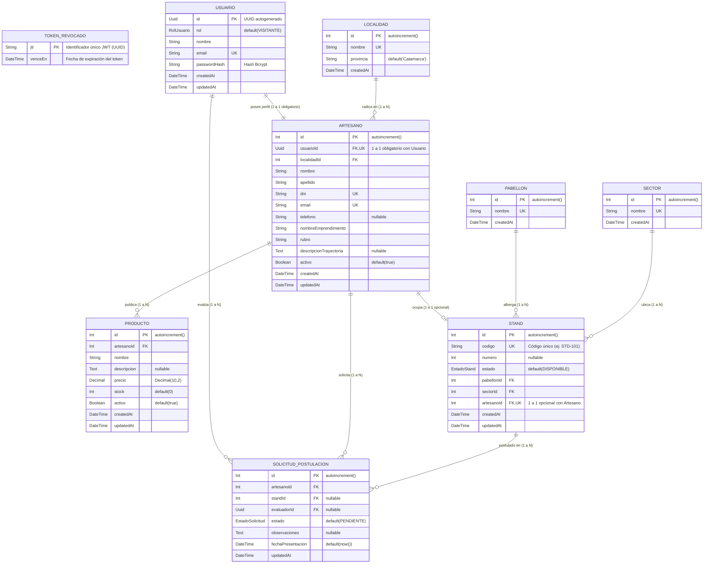

# Estructura del Esquema de Base de Datos — Poncho Digital

**Cátedra:** Desarrollo Backend  
**Proyecto:** Poncho Digital — API REST de la Fiesta Nacional e Internacional del Poncho  
**ORM:** Prisma 7 con PostgreSQL  

---

## 1. Introducción y Fundamentos Teóricos

El modelo de datos de **Poncho Digital** fue diseñado bajo los principios de **diseño relacional en Tercera Forma Normal (3FN)** para garantizar la integridad referencial, evitar redundancias innecesarias y representar con precisión las reglas del dominio de la feria artesanal.

### Principales decisiones de diseño:
1. **Identificadores Criptográficos (UUID) para Cuentas de Usuario:**  
   Se utiliza el tipo nativo `UUID` de PostgreSQL para la entidad `Usuario`. Esto previene ataques de enumeración (adivinación secuencial de IDs de usuarios), desacopla la generación de identificadores y se alinea con estándares de seguridad modernos.
2. **Identificadores Enteros Autoincrementales para Entidades de Negocio:**  
   Las entidades del dominio físico o de catálogo (`Artesano`, `Producto`, `Stand`, `Pabellon`, `Sector`, `Localidad`) emplean enteros autoincrementales (`SERIAL / Int`), optimizando el tamaño de los índices B-Tree en llaves foráneas y búsquedas por clave primaria.
3. **Manejo de Moneda con `Decimal(10, 2)`:**  
   En `Producto`, el precio se define como `Decimal(10, 2)` en lugar de coma flotante (`Float`), garantizando exactitud matemática sin pérdidas por redondeo binario.
4. **Soft Delete (Baja Lógica):**  
   Tanto `Artesano` como `Producto` poseen una columna `activo Boolean @default(true)`, lo que permite preservar el histórico de ventas o stands ocupados sin perder trazabilidad al dar de baja un registro.
5. **Lista Negra Persistente de Tokens Revocados (`TokenRevocado`):**  
   Para implementar un cierre de sesión seguro en un esquema de autenticación sin estado (stateless JWT), se modela una entidad dedicada con clave primaria `jti` (JWT ID criptográfico) y marca de tiempo `venceEn`. Un índice B-Tree sobre `venceEn` garantiza consultas ultrarrápidas y permite a tareas en segundo plano purgar masivamente registros expirados sin penalizar el rendimiento.

---

## 2. Diagrama Entidad-Relación

### Esquema Gráfico del Modelo (DER)


### Representación en Código Mermaid



---

## 3. Tipos Enumerados (Enums)

Los enums representan conjuntos cerrados de valores a nivel de motor de base de datos (`CREATE TYPE ... AS ENUM`):

### `RolUsuario`
Define los niveles de acceso y responsabilidades en la plataforma:
- **`ADMINISTRADOR`**: Control total del sistema, gestión de usuarios, asignación de roles y stands.
- **`EVALUADOR`**: Personal del jurado o comité ferial encargado de auditar y dictaminar las solicitudes de postulación (`SolicitudPostulacion`).
- **`ARTESANO`**: Usuario habilitado para administrar su propio emprendimiento y catálogo de productos.
- **`VISITANTE`**: Rol por defecto al registrarse (`@default(VISITANTE)`). Usuario general que explora la feria.

### `EstadoStand`
Controla la disponibilidad física y operativa de los espacios:
- **`DISPONIBLE`**: El stand no tiene ningún artesano asignado y está listo para ser otorgado.
- **`OCUPADO`**: Stand asignado a un artesano titular.
- **`MANTENIMIENTO`**: Stand inhabilitado temporalmente por refacciones técnicas, cableado o inspección.

### `EstadoSolicitud`
Gestiona el ciclo de vida del trámite de postulación de stands:
- **`PENDIENTE`**: Solicitud enviada por el artesano en espera de revisión inicial.
- **`EN_REVISION`**: La solicitud está siendo analizada por un evaluador.
- **`APROBADA`**: Postulación aceptada formalmente (habilita la asignación del stand).
- **`RECHAZADA`**: Postulación desestimada con observaciones explicativas.

---

## 4. Modelos en Detalle y Conectividad Relacional

### 4.1. `Usuario`
Representa las credenciales y la identidad de autenticación:
- **`id` (`UUID`)**: Clave primaria global.
- **`rol` (`RolUsuario`)**: Asignado como `VISITANTE` por defecto en PostgreSQL.
- **`passwordHash` (`String`)**: Contraseña cifrada de forma unidireccional con **Bcrypt** (cost factor 10). La contraseña en plano nunca se persiste.
- **Conectividad:**
  - Relación `1:1` con `Artesano`: si un usuario adquiere perfil de artesano, se vincula de manera biunívoca.
  - Relación `1:N` con `SolicitudPostulacion` (`@relation("EvaluadorSolicitud")`): un usuario con rol evaluador o admin puede dictaminar múltiples postulaciones.

### 4.2. `Artesano`
Entidad central del negocio. Representa al productor artesanal y su taller:
- **`usuarioId` (`UUID`, `@unique`)**: **1 a 1 Obligatorio**. Un artesano no puede existir sin una cuenta de usuario vinculada. Posee regla `onDelete: Cascade` (si se elimina la cuenta de usuario, se elimina el perfil de artesano).
- **`dni` y `email` (`@unique`)**: Garantizan que no existan perfiles duplicados de la misma persona.
- **Conectividad:**
  - `N:1` con `Localidad`: indica la procedencia geográfica dentro de Catamarca.
  - `1:N` con `Producto`: un artesano elabora y administra su lista de artículos.
  - `1:1` con `Stand` (`stand Stand?`): un artesano tiene como máximo **un stand físico** asignado.
  - `1:N` con `SolicitudPostulacion`: el artesano puede generar solicitudes para participar en la feria.

### 4.3. `Producto`
Artículos comercializados por los artesanos:
- **`artesanoId` (`Int`, FK)**: Clave foránea que referencia al creador del producto.
- **`precio` (`Decimal(10,2)`)**: Soporta valores hasta `$99,999,999.99` con precisión exacta de centavos.
- **`activo` (`Boolean`)**: Bandera para soft delete. Permite ocultar productos sin stock o discontinuados sin borrar registros históricos.
- **Conectividad:**
  - Posee regla `onDelete: Cascade`: la baja física de un artesano elimina en cascada sus productos vinculados.

### 4.4. `Pabellon` y `Sector`
Normalización de la infraestructura del predio ferial:
- **`Pabellon`**: Grandes naves edilicias de la feria (ej: "Pabellón de Artesanías Tradicionales", "Pabellón Industrial").
- **`Sector`**: Subdivisión espacial interna (ej: "Sector Norte", "Sector Textil", "Pasillo A").
- **Conectividad:**
  - Cada stand pertenece obligatoriamente a un pabellón (`pabellonId`) y a un sector (`sectorId`). Ambas claves foráneas cuentan con índices de base de datos (`@@index`) para optimizar filtros rápidos en el mapa y la web.

### 4.5. `Stand`
Puesto físico asignable durante la fiesta:
- **`codigo` (`String @unique`)**: Identificador único visible en el plano (ej: `STD-A01`).
- **`artesanoId` (`Int? @unique`)**: Llave foránea única anulable.
  - Si es `null`, el stand se encuentra disponible.
  - Al poseer `@unique`, el motor de base de datos rechaza cualquier intento de asignar un artesano a más de un stand a la vez (**restricción 1 a 1 estricta**).
  - Regla `onDelete: SetNull`: si se da de baja al artesano, el stand no se destruye, sino que se libera su asignación.

### 4.6. `SolicitudPostulacion`
Trámite digital mediante el cual los artesanos postulan a la feria:
- **`artesanoId` (`Int`)**: Artesano solicitante.
- **`standId` (`Int?`)**: Stand específico al que aspira o que le fue preasignado.
- **`evaluadorId` (`UUID?`)**: Usuario evaluador asignado a auditar la solicitud.
- **`estado` (`EstadoSolicitud`)**: Estado actual del trámite.
- **Conectividad:**
  - Si el artesano postulante se elimina, sus solicitudes se suprimen en cascada (`onDelete: Cascade`).
  - Si el evaluador o el stand se desvinculan, la solicitud se conserva con valor nulo para auditoría (`onDelete: SetNull`).

### 4.7. `TokenRevocado`
Entidad técnica de seguridad para invalidación prematura de tokens JWT (Lista Negra de Sesiones):
- **`jti` (`String`, `@id`)**: Clave primaria que almacena el *JWT ID* (UUID v4 criptográfico asignado unívocamente a cada token emitido en `/login`).
- **`venceEn` (`DateTime`)**: Timestamp que refleja el vencimiento natural del token (`exp`).
- **Índice secundario `@@index([venceEn])`**: Crea un índice B-Tree dedicado sobre la fecha de expiración, posibilitando que la tarea de fondo elimine en lote (`deleteMany`) registros antiguos sin bloqueos de tabla.
- **Conectividad y ciclo de vida:**
  - No posee claves foráneas para mantener desacoplada la infraestructura de revocación de la tabla `Usuario`.
  - Los registros se insertan de forma idempotente con `upsert` al invocarse `POST /usuarios/logout`.
  - Permite denegar el acceso inmediato en el middleware `autenticarUsuario` aun si el token no superó sus 15 minutos de vida.

---

## 5. Resumen de Políticas de Integridad Referencial (`onDelete`)

| Origen | Destino | Relación | Política `onDelete` | Justificación de Negocio |
|---|---|---|---|---|
| `Artesano` | `Usuario` | 1 a 1 | **`Cascade`** | Un artesano no puede existir sin su cuenta de acceso; si la cuenta se borra, el perfil artesanal se elimina. |
| `Producto` | `Artesano` | N a 1 | **`Cascade`** | El catálogo depende íntegramente de la existencia de su artesano creador. |
| `Stand` | `Artesano` | 1 a 1 | **`SetNull`** | Si un artesano cancela o se da de baja, el espacio físico del stand permanece intacto para otro participante. |
| `Stand` | `Pabellon` | N a 1 | **`Restrict`** | No se puede eliminar un pabellón que aún contenga stands registrados. |
| `Stand` | `Sector` | N a 1 | **`Restrict`** | No se puede eliminar un sector mientras existan stands asignados a él. |
| `Solicitud` | `Artesano` | N a 1 | **`Cascade`** | Las postulaciones son propiedad del artesano solicitante. |
| `Solicitud` | `Usuario` | N a 1 | **`SetNull`** | Si un evaluador renuncia o se borra, la postulación preserva su histórico y queda lista para ser reasignada. |
| `TokenRevocado` | *Independiente* | Sin FK | **—** | Tabla de revocación técnica; administración de ciclo de vida por purga automática temporal (`deleteMany`). |

---

## 6. Verificación en el Entorno

El esquema actual incluye la migración `20261008000300_create_token_revocado` y se encuentra completamente aplicado y validado contra PostgreSQL (Supabase):
```bash
# Validar consistencia del schema
npx prisma validate

# Comprobar sincronización con la base de datos
npx prisma migrate status
```
Salida confirmada:
```
Database schema is up to date!
The schema at prisma\schema.prisma is valid
```
