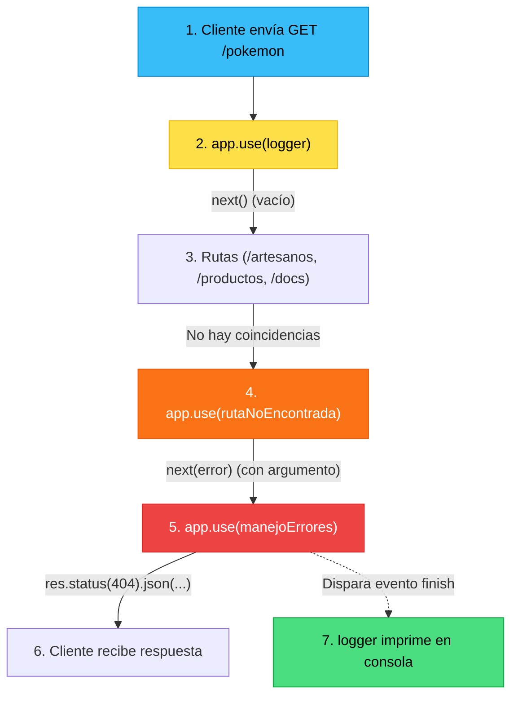
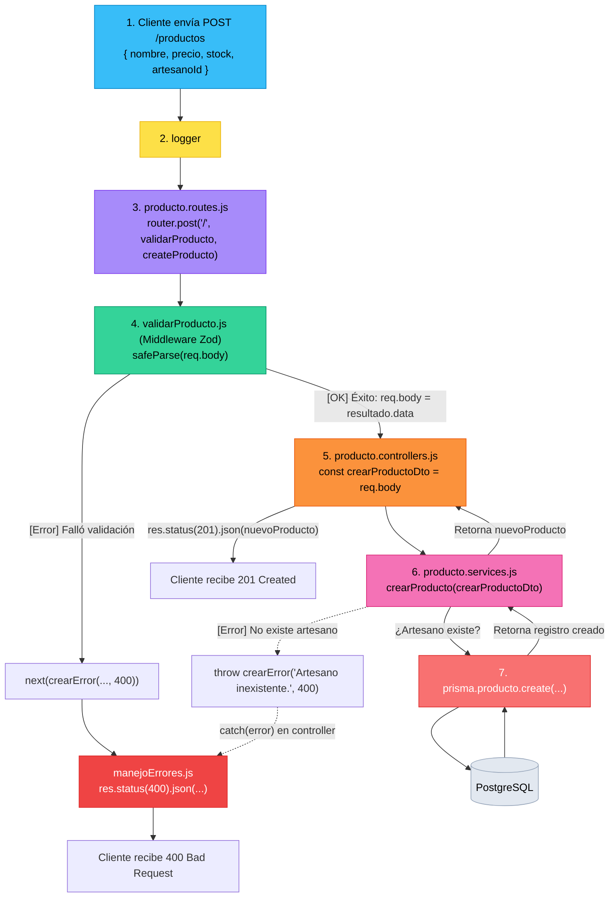
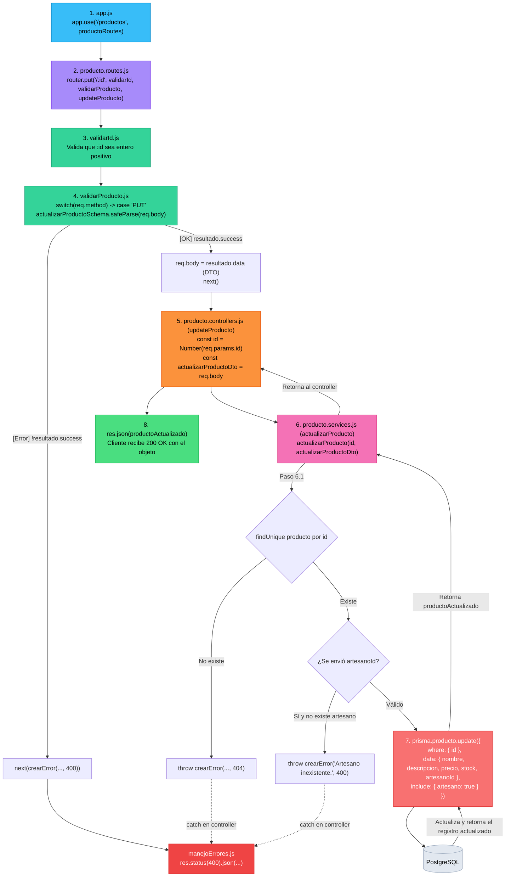
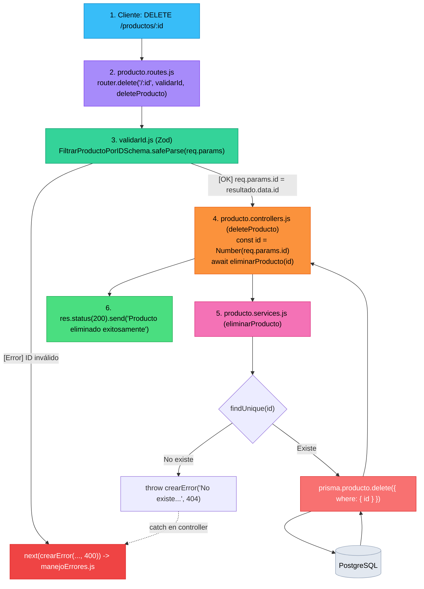
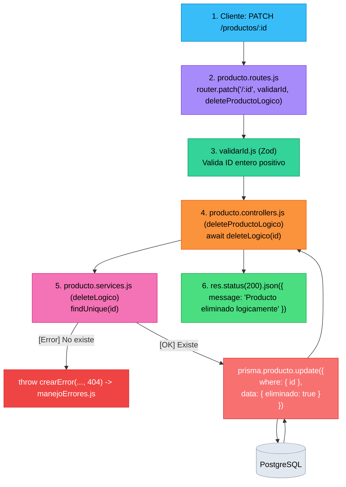

# Flujo de Ejecución y Manejo de Errores en Express

> **Caso de ejemplo:** El cliente realiza una petición a una ruta que no existe:  
> `GET http://localhost:3000/pokemon`

---

## Diagrama de Flujo



---

## Paso a Paso del Ciclo de Vida

### 1. Entrada y Registro: `app.use(logger)`
* Inicia el cronómetro: `const start = Date.now();`
* Se queda escuchando el evento de cierre de la respuesta: `res.on('finish', ...)`.
* Llama a **`next()`** *(sin argumentos)* para dar paso a la siguiente etapa.

### 2. Evaluación de Rutas
* Express compara la URL solicitada (`/pokemon`) con las rutas registradas:
  * `/` (No coincide)
  * `/info` (No coincide)
  * `/artesanos` (No coincide)
  * `/productos` (No coincide)
  * `/docs` (No coincide)
* Al no coincidir con ninguna, la petición continúa descendiendo por la cadena de middlewares.

### 3. Captura de Ruta Inexistente: `app.use(rutaNoEncontrada)`
* Al estar ubicada después de todas las rutas válidas, esta función captura cualquier petición no atendida.
* Ejecuta:
  ```javascript
  next(crearError(`Ruta no encontrada: ${req.method} ${req.originalUrl}`, 404));
  ```

> [!IMPORTANT]
> **La regla de oro de `next` en Express:**
> * `next()` *(vacío)* $\rightarrow$ Continúa al siguiente middleware normal.
> * `next(error)` *(con argumento)* $\rightarrow$ Express activa el **modo de error**, omite todos los middlewares normales restantes y salta directamente al siguiente **middleware de 4 parámetros** `(err, req, res, next)`.

### 4. Manejador Centralizado: `app.use(manejoErrores)`
* Express detecta la firma especial de 4 parámetros: `(err, req, res, next)`.
* Recibe el objeto generado por `crearError(...)` en el parámetro `err`.
* Extrae el código de estado (`err.status = 404`) y el mensaje (`err.message`).
* Envía la respuesta al cliente cerrando la conexión HTTP:
  ```javascript
  res.status(404).json({ error: "Ruta no encontrada: GET /pokemon" });
  ```

### 5. Finalización y Registro del Log: `res.on('finish')`
* La llamada a `res.json()` completa el envío y emite el evento `'finish'`.
* El listener configurado por el **`logger`** en el paso 1 se activa.
* Calcula la duración total y muestra en la terminal:
  ```text
  GET /pokemon - 404 (2ms)
  ```

---

## Resumen de Responsabilidades

| Middleware / Utilidad | Tipo | Responsabilidad Principal |
|---|---|---|
| **`logger`** | Informativo | Cronometra y registra en consola el resultado final de cada petición. |
| **`crearError`** | Utilidad (`utils`) | Estandariza la creación de objetos `Error` adjuntando un `status` HTTP. |
| **`rutaNoEncontrada`** | Middleware 404 | Intercepta peticiones huérfanas y delega un error 404 mediante `next(...)`. |
| **`manejoErrores`** | Middleware de Errores | Centraliza la respuesta JSON y oculta errores técnicos internos (500). |

---

## Flujo Completo de un Endpoint CRUD: `POST /productos`

Este flujo muestra la separación de responsabilidades de la **Unidad 3**: el validador (Zod) detiene entradas inválidas en el middleware, el controlador transfiere los datos limpios como **DTO** y el servicio ejecuta la lógica y persistencia con Prisma.



---

## Flujo Completo de Actualización: `PUT /productos/:id`

Este flujo describe paso a paso el recorrido desde el cliente hasta la persistencia y respuesta:



### Detalle de las 8 etapas del flujo:
1. **Entrada al servidor (`app.js`):** La petición HTTP `PUT /productos/:id` ingresa y es derivada al enrutador `productoRoutes`.
2. **Definición de ruta y tubería (`producto.routes.js`):** Se encadenan los middlewares `validarId`, `validarProducto` y el controlador `updateProducto`.
3. **Validación de identificador (`validarId.js`):** Comprueba que `:id` sea convertible a entero positivo.
4. **Validación de datos con Zod (`validarProducto.js`):** Mediante un `switch`, selecciona `actualizarProductoSchema` y ejecuta `safeParse(req.body)`. Si falla, corta la ejecución con error 400. Si aprueba, almacena los datos limpios en `req.body` y continúa con `next()`.
5. **Controlador (`updateProducto`):** Extrae los datos preparados (`id` numérico y `actualizarProductoDto`) y convoca a la capa de servicios mediante `await actualizarProducto(...)`.
6. **Lógica de negocio (`producto.services.js`):**
   - Comprueba la existencia previa del producto mediante `findUnique` (si no existe, lanza un error 404 con `throw crearError(...)`).
   - Comprueba la validez de `artesanoId` si fue provisto (si no existe el artesano, lanza un error 400).
7. **Persistencia con Prisma ORM (`prisma.producto.update`):** Envía el objeto de actualización con los campos correspondientes e incluye la relación `artesano: true`. PostgreSQL ejecuta la actualización y devuelve en una sola operación el registro modificado junto con los datos del artesano.
8. **Respuesta al cliente:** El controlador recibe el objeto del producto actualizado y responde con `res.json(productoActualizado)` (código HTTP 200).

---

## Flujo Completo de Eliminación Física y Lógica: `DELETE` y `PATCH`

### 1. Eliminación Física Definitiva (`DELETE /productos/:id`)



### 2. Eliminación Lógica / Soft Delete (`PATCH /productos/:id`)




