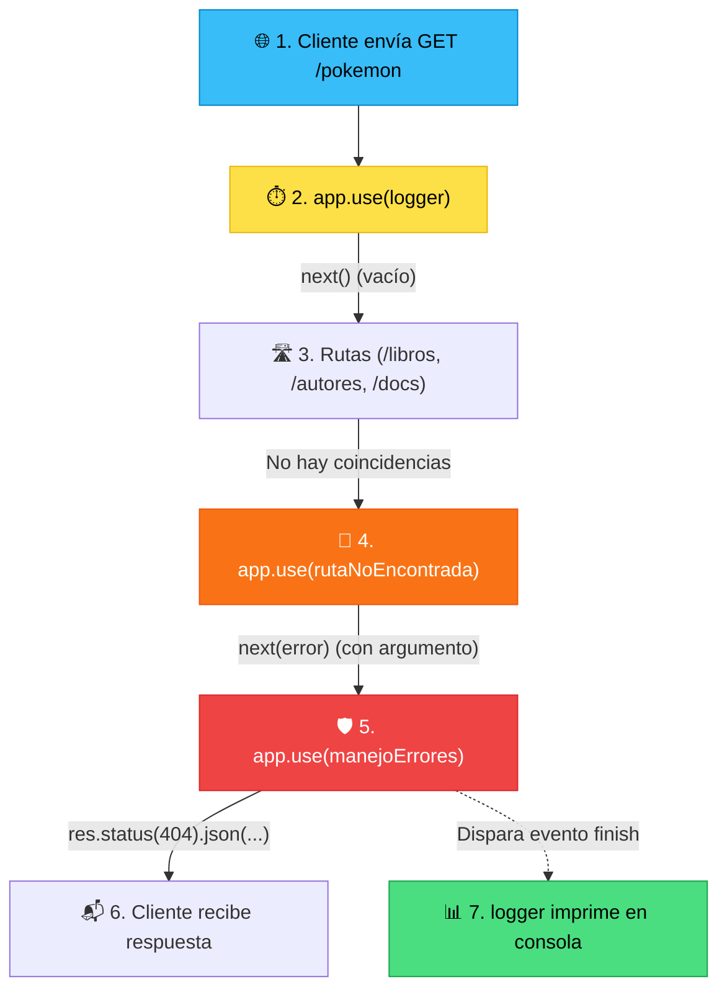

# Flujo de Ejecución y Manejo de Errores en Express

> **Caso de ejemplo:** El cliente realiza una petición a una ruta que no existe:  
> `GET http://localhost:3000/pokemon`

---

## 🗺️ Diagrama de Flujo



---

## 🔄 Paso a Paso del Ciclo de Vida

### 1. Entrada y Registro: `app.use(logger)`
* Inicia el cronómetro: `const start = Date.now();`
* Se queda escuchando el evento de cierre de la respuesta: `res.on('finish', ...)`.
* Llama a **`next()`** *(sin argumentos)* para dar paso a la siguiente etapa.

### 2. Evaluación de Rutas
* Express compara la URL solicitada (`/pokemon`) con las rutas registradas:
  * `/` ❌
  * `/info` ❌
  * `/libros` ❌
  * `/autores` ❌
  * `/docs` ❌
* Al no coincidir con ninguna, la petición continúa descendiendo por la cadena de middlewares.

### 3. Captura de Ruta Inexistente: `app.use(rutaNoEncontrada)`
* Al estar ubicada después de todas las rutas válidas, esta función captura cualquier petición no atendida.
* Ejecuta:
  ```javascript
  next(crearError(`Ruta no encontrada: ${req.method} ${req.originalUrl}`, 404));
  ```

> [!IMPORTANT]
> **La regla de oro de `next` en Express:**
> * `next()` *(vacío)* $\rightarrow$ Continúa al siguiente middleware normal.
> * `next(error)` *(con argumento)* $\rightarrow$ Express activa el **modo de error**, omite todos los middlewares normales restantes y salta directamente al siguiente **middleware de 4 parámetros** `(err, req, res, next)`.

### 4. Manejador Centralizado: `app.use(manejoErrores)`
* Express detecta la firma especial de 4 parámetros: `(err, req, res, next)`.
* Recibe el objeto generado por `crearError(...)` en el parámetro `err`.
* Extrae el código de estado (`err.status = 404`) y el mensaje (`err.message`).
* Envía la respuesta al cliente cerrando la conexión HTTP:
  ```javascript
  res.status(404).json({ error: "Ruta no encontrada: GET /pokemon" });
  ```

### 5. Finalización y Registro del Log: `res.on('finish')`
* La llamada a `res.json()` completa el envío y emite el evento `'finish'`.
* El listener configurado por el **`logger`** en el paso 1 se activa.
* Calcula la duración total y muestra en la terminal:
  ```text
  GET /pokemon - 404 (2ms)
  ```

---

## 📋 Resumen de Responsabilidades

| Middleware / Utilidad | Tipo | Responsabilidad Principal |
|---|---|---|
| **`logger`** | Informativo | Cronometra y registra en consola el resultado final de cada petición. |
| **`crearError`** | Utilidad (`utils`) | Estandariza la creación de objetos `Error` adjuntando un `status` HTTP. |
| **`rutaNoEncontrada`** | Middleware 404 | Intercepta peticiones huérfanas y delega un error 404 mediante `next(...)`. |
| **`manejoErrores`** | Middleware de Errores | Centraliza la respuesta JSON y oculta errores técnicos internos (500). |

